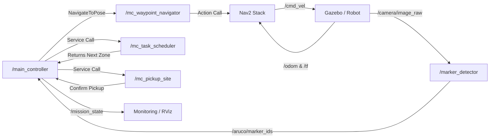

# ROS 2 Computation Graph (rqt_graph)

This diagram visualizes how our nodes communicate via topics and actions.



## How to see the interactive version:
1. Start your simulation with `./quick_start.sh`.
2. Open a new terminal and enter the docker container:
   ```bash
   docker exec -it $(docker ps -q --filter ancestor=object_fetcher) bash
   ```
3. Run the following command:
   ```bash
   ros2 run rqt_graph rqt_graph
   ```
   *Note: This will open a window showing the live connections between all running nodes.*
